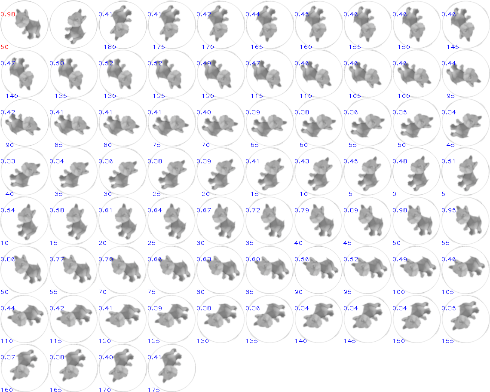
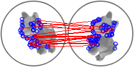

# golang + opencv + gocv 样例项目

- 基础库制作: `docker build -f Dockerfile-base -t ohko/gocv-base-440 .`
- 项目制作: `docker build -f Dockerfile -t ohko/opencv_test .`
- 项目测试: `docker run --rm -it ohko/opencv_test`

# 指令
- AnalyseAnimal: 分析主体图像
- Check: 360旋转对比图像，返回最优对比结果
- Check1: 返回图像相似度，不同角度相似度不同
- Check2: 返回图像相似度，与角度无关




``` shell
$ go run .
[   data/1/3.png -    data/1/2.png] Percent:0.977 Rate:  50 √
[   data/1/3.png -    data/1/4.png] Percent:0.977 Rate: -50 √
[   data/1/3.png -    data/1/5.png] Percent:0.958 Rate:-105 √
[   data/1/3.png -    data/1/6.png] Percent:0.956 Rate:-155 √
[   data/1/3.png -    data/1/7.png] Percent:0.964 Rate: 155 √
[   data/1/3.png -    data/1/8.png] Percent:0.967 Rate: 105 √
[   data/1/3.png -    data/2/9.png] Percent:0.780 Rate: -20 x
[   data/1/3.png -   data/2/10.png] Percent:0.771 Rate: -75 x
[   data/1/3.png -   data/2/11.png] Percent:0.769 Rate:-125 x
[   data/1/3.png -   data/2/12.png] Percent:0.780 Rate:-175 x
[   data/1/3.png -   data/2/13.png] Percent:0.787 Rate: 135 x
[   data/1/3.png -   data/2/15.png] Percent:0.793 Rate:  30 x
[   data/1/3.png -   data/3/16.png] Percent:0.770 Rate:-170 x
[   data/1/3.png -   data/3/17.png] Percent:0.770 Rate: 140 x
[   data/1/3.png -   data/3/18.png] Percent:0.758 Rate:  85 x
[   data/1/3.png -   data/3/19.png] Percent:0.756 Rate:  35 x
[   data/1/3.png -   data/3/21.png] Percent:0.764 Rate: -70 x
[   data/1/3.png -   data/3/22.png] Percent:0.773 Rate:-120 x
[   data/1/3.png -    data/4/2.png] Percent:0.630 Rate:-120 x
[   data/1/3.png -    data/4/3.png] Percent:0.636 Rate:-175 x
[   data/1/3.png -    data/4/4.png] Percent:0.640 Rate: 135 x
[   data/1/3.png -    data/4/5.png] Percent:0.643 Rate:  80 x
[   data/1/3.png -    data/4/6.png] Percent:0.642 Rate:  30 x
[   data/1/3.png -    data/4/7.png] Percent:0.635 Rate: -20 x
[   data/1/3.png -    data/5/1.png] Percent:0.599 Rate:  10 x
[   data/1/3.png -    data/5/2.png] Percent:0.610 Rate: -40 x
[   data/1/3.png -    data/5/3.png] Percent:0.615 Rate: -95 x
[   data/1/3.png -    data/5/4.png] Percent:0.610 Rate:-145 x
[   data/1/3.png -    data/5/5.png] Percent:0.613 Rate: 165 x
[   data/1/3.png -    data/5/6.png] Percent:0.600 Rate: 105 x
[   data/1/3.png -   data/12/2.png] Percent:0.587 Rate: 135 x
[   data/1/3.png -   data/12/3.png] Percent:0.601 Rate:  80 x
[   data/1/3.png -   data/12/4.png] Percent:0.613 Rate:  30 x
[   data/1/3.png -   data/12/5.png] Percent:0.620 Rate: -20 x
[   data/1/3.png -   data/12/6.png] Percent:0.620 Rate: -70 x
[   data/1/3.png -   data/12/7.png] Percent:0.602 Rate:-120 x

[  data/2/14.png -    data/1/2.png] Percent:0.786 Rate: -30 x
[  data/2/14.png -    data/1/4.png] Percent:0.796 Rate:-135 x
[  data/2/14.png -    data/1/5.png] Percent:0.804 Rate: 175 x
[  data/2/14.png -    data/1/6.png] Percent:0.796 Rate: 125 x
[  data/2/14.png -    data/1/7.png] Percent:0.792 Rate:  75 x
[  data/2/14.png -    data/1/8.png] Percent:0.787 Rate:  20 x
[  data/2/14.png -    data/2/9.png] Percent:0.977 Rate:-105 √
[  data/2/14.png -   data/2/10.png] Percent:0.968 Rate:-155 √
[  data/2/14.png -   data/2/11.png] Percent:0.966 Rate: 155 √
[  data/2/14.png -   data/2/12.png] Percent:0.971 Rate: 105 √
[  data/2/14.png -   data/2/13.png] Percent:0.981 Rate:  50 √
[  data/2/14.png -   data/2/15.png] Percent:0.976 Rate: -50 √
[  data/2/14.png -   data/3/16.png] Percent:0.736 Rate:  95 x
[  data/2/14.png -   data/3/17.png] Percent:0.734 Rate:  40 x
[  data/2/14.png -   data/3/18.png] Percent:0.735 Rate: -15 x
[  data/2/14.png -   data/3/19.png] Percent:0.744 Rate: -65 x
[  data/2/14.png -   data/3/21.png] Percent:0.751 Rate:-165 x
[  data/2/14.png -   data/3/22.png] Percent:0.743 Rate: 145 x
[  data/2/14.png -    data/4/2.png] Percent:0.640 Rate: 150 x
[  data/2/14.png -    data/4/3.png] Percent:0.650 Rate: 100 x
[  data/2/14.png -    data/4/4.png] Percent:0.652 Rate:  45 x
[  data/2/14.png -    data/4/5.png] Percent:0.647 Rate:  -5 x
[  data/2/14.png -    data/4/6.png] Percent:0.635 Rate: -60 x
[  data/2/14.png -    data/4/7.png] Percent:0.629 Rate:-105 x
[  data/2/14.png -    data/5/1.png] Percent:0.604 Rate: -70 x
[  data/2/14.png -    data/5/2.png] Percent:0.618 Rate:-120 x
[  data/2/14.png -    data/5/3.png] Percent:0.628 Rate:-170 x
[  data/2/14.png -    data/5/4.png] Percent:0.628 Rate: 140 x
[  data/2/14.png -    data/5/5.png] Percent:0.641 Rate:  85 x
[  data/2/14.png -    data/5/6.png] Percent:0.623 Rate:  35 x
[  data/2/14.png -   data/12/2.png] Percent:0.549 Rate:  50 x
[  data/2/14.png -   data/12/3.png] Percent:0.560 Rate:   5 x
[  data/2/14.png -   data/12/4.png] Percent:0.562 Rate: -45 x
[  data/2/14.png -   data/12/5.png] Percent:0.572 Rate:-100 x
[  data/2/14.png -   data/12/6.png] Percent:0.570 Rate:-150 x
[  data/2/14.png -   data/12/7.png] Percent:0.558 Rate: 160 x

[  data/3/20.png -    data/1/2.png] Percent:0.752 Rate:  65 x
[  data/3/20.png -    data/1/4.png] Percent:0.748 Rate: -35 x
[  data/3/20.png -    data/1/5.png] Percent:0.737 Rate: -85 x
[  data/3/20.png -    data/1/6.png] Percent:0.721 Rate:-140 x
[  data/3/20.png -    data/1/7.png] Percent:0.730 Rate: 170 x
[  data/3/20.png -    data/1/8.png] Percent:0.736 Rate: 115 x
[  data/3/20.png -    data/2/9.png] Percent:0.733 Rate:  15 x
[  data/3/20.png -   data/2/10.png] Percent:0.723 Rate: -35 x
[  data/3/20.png -   data/2/11.png] Percent:0.725 Rate: -90 x
[  data/3/20.png -   data/2/12.png] Percent:0.732 Rate:-140 x
[  data/3/20.png -   data/2/13.png] Percent:0.739 Rate: 165 x
[  data/3/20.png -   data/2/15.png] Percent:0.739 Rate:  65 x
[  data/3/20.png -   data/3/16.png] Percent:0.960 Rate:-155 √
[  data/3/20.png -   data/3/17.png] Percent:0.954 Rate: 155 √
[  data/3/20.png -   data/3/18.png] Percent:0.962 Rate: 105 √
[  data/3/20.png -   data/3/19.png] Percent:0.977 Rate:  50 √
[  data/3/20.png -   data/3/21.png] Percent:0.980 Rate: -50 √
[  data/3/20.png -   data/3/22.png] Percent:0.971 Rate:-105 √
[  data/3/20.png -    data/4/2.png] Percent:0.631 Rate: -85 x
[  data/3/20.png -    data/4/3.png] Percent:0.634 Rate:-135 x
[  data/3/20.png -    data/4/4.png] Percent:0.641 Rate: 170 x
[  data/3/20.png -    data/4/5.png] Percent:0.628 Rate: 120 x
[  data/3/20.png -    data/4/6.png] Percent:0.625 Rate:  65 x
[  data/3/20.png -    data/4/7.png] Percent:0.622 Rate:  15 x
[  data/3/20.png -    data/5/1.png] Percent:0.625 Rate:  50 x
[  data/3/20.png -    data/5/2.png] Percent:0.644 Rate:   0 x
[  data/3/20.png -    data/5/3.png] Percent:0.640 Rate: -50 x
[  data/3/20.png -    data/5/4.png] Percent:0.642 Rate:-105 x
[  data/3/20.png -    data/5/5.png] Percent:0.641 Rate:-155 x
[  data/3/20.png -    data/5/6.png] Percent:0.626 Rate: 155 x
[  data/3/20.png -   data/12/2.png] Percent:0.604 Rate: 160 x
[  data/3/20.png -   data/12/3.png] Percent:0.609 Rate: 110 x
[  data/3/20.png -   data/12/4.png] Percent:0.625 Rate:  60 x
[  data/3/20.png -   data/12/5.png] Percent:0.639 Rate:   5 x
[  data/3/20.png -   data/12/6.png] Percent:0.635 Rate: -45 x
[  data/3/20.png -   data/12/7.png] Percent:0.623 Rate: -95 x

[   data/4/1.png -    data/1/2.png] Percent:0.615 Rate: 120 x
[   data/4/1.png -    data/1/4.png] Percent:0.639 Rate:  20 x
[   data/4/1.png -    data/1/5.png] Percent:0.631 Rate: -30 x
[   data/4/1.png -    data/1/6.png] Percent:0.625 Rate: -80 x
[   data/4/1.png -    data/1/7.png] Percent:0.606 Rate:-135 x
[   data/4/1.png -    data/1/8.png] Percent:0.609 Rate: 175 x
[   data/4/1.png -    data/2/9.png] Percent:0.645 Rate:  55 x
[   data/4/1.png -   data/2/10.png] Percent:0.648 Rate:   5 x
[   data/4/1.png -   data/2/11.png] Percent:0.634 Rate: -45 x
[   data/4/1.png -   data/2/12.png] Percent:0.628 Rate: -95 x
[   data/4/1.png -   data/2/13.png] Percent:0.621 Rate:-150 x
[   data/4/1.png -   data/2/15.png] Percent:0.640 Rate: 105 x
[   data/4/1.png -   data/3/16.png] Percent:0.591 Rate:-120 x
[   data/4/1.png -   data/3/17.png] Percent:0.586 Rate:-170 x
[   data/4/1.png -   data/3/18.png] Percent:0.593 Rate: 135 x
[   data/4/1.png -   data/3/19.png] Percent:0.616 Rate:  85 x
[   data/4/1.png -   data/3/21.png] Percent:0.624 Rate: -15 x
[   data/4/1.png -   data/3/22.png] Percent:0.602 Rate: -65 x
[   data/4/1.png -    data/4/2.png] Percent:0.972 Rate: -50 √
[   data/4/1.png -    data/4/3.png] Percent:0.970 Rate:-105 √
[   data/4/1.png -    data/4/4.png] Percent:0.958 Rate:-155 √
[   data/4/1.png -    data/4/5.png] Percent:0.948 Rate: 155 √
[   data/4/1.png -    data/4/6.png] Percent:0.955 Rate: 100 √
[   data/4/1.png -    data/4/7.png] Percent:0.977 Rate:  50 √
[   data/4/1.png -    data/5/1.png] Percent:0.634 Rate:  75 x
[   data/4/1.png -    data/5/2.png] Percent:0.658 Rate:  25 x
[   data/4/1.png -    data/5/3.png] Percent:0.658 Rate: -25 x
[   data/4/1.png -    data/5/4.png] Percent:0.654 Rate: -80 x
[   data/4/1.png -    data/5/5.png] Percent:0.631 Rate:-130 x
[   data/4/1.png -    data/5/6.png] Percent:0.628 Rate: 175 x
[   data/4/1.png -   data/12/2.png] Percent:0.512 Rate:-155 x
[   data/4/1.png -   data/12/3.png] Percent:0.515 Rate: 155 x
[   data/4/1.png -   data/12/4.png] Percent:0.533 Rate: 105 x
[   data/4/1.png -   data/12/5.png] Percent:0.547 Rate:  50 x
[   data/4/1.png -   data/12/6.png] Percent:0.572 Rate:   0 x
[   data/4/1.png -   data/12/7.png] Percent:0.543 Rate: -50 x

[   data/5/7.png -    data/1/2.png] Percent:0.609 Rate: -10 x
[   data/5/7.png -    data/1/4.png] Percent:0.593 Rate:-100 x
[   data/5/7.png -    data/1/5.png] Percent:0.576 Rate:-155 x
[   data/5/7.png -    data/1/6.png] Percent:0.573 Rate: 145 x
[   data/5/7.png -    data/1/7.png] Percent:0.588 Rate:  95 x
[   data/5/7.png -    data/1/8.png] Percent:0.600 Rate:  40 x
[   data/5/7.png -    data/2/9.png] Percent:0.603 Rate: -85 x
[   data/5/7.png -   data/2/10.png] Percent:0.584 Rate:-135 x
[   data/5/7.png -   data/2/11.png] Percent:0.578 Rate: 170 x
[   data/5/7.png -   data/2/12.png] Percent:0.586 Rate: 120 x
[   data/5/7.png -   data/2/13.png] Percent:0.600 Rate:  70 x
[   data/5/7.png -   data/2/15.png] Percent:0.621 Rate: -35 x
[   data/5/7.png -   data/3/16.png] Percent:0.623 Rate: 105 x
[   data/5/7.png -   data/3/17.png] Percent:0.633 Rate:  55 x
[   data/5/7.png -   data/3/18.png] Percent:0.647 Rate:   0 x
[   data/5/7.png -   data/3/19.png] Percent:0.643 Rate: -50 x
[   data/5/7.png -   data/3/21.png] Percent:0.621 Rate:-150 x
[   data/5/7.png -   data/3/22.png] Percent:0.615 Rate: 155 x
[   data/5/7.png -    data/4/2.png] Percent:0.626 Rate:-175 x
[   data/5/7.png -    data/4/3.png] Percent:0.630 Rate: 130 x
[   data/5/7.png -    data/4/4.png] Percent:0.649 Rate:  75 x
[   data/5/7.png -    data/4/5.png] Percent:0.658 Rate:  25 x
[   data/5/7.png -    data/4/6.png] Percent:0.654 Rate: -25 x
[   data/5/7.png -    data/4/7.png] Percent:0.641 Rate: -75 x
[   data/5/7.png -    data/5/1.png] Percent:0.947 Rate: -50 √
[   data/5/7.png -    data/5/2.png] Percent:0.944 Rate:-105 √
[   data/5/7.png -    data/5/3.png] Percent:0.930 Rate:-155 √
[   data/5/7.png -    data/5/4.png] Percent:0.945 Rate: 155 √
[   data/5/7.png -    data/5/5.png] Percent:0.954 Rate: 105 √
[   data/5/7.png -    data/5/6.png] Percent:0.964 Rate:  50 √
[   data/5/7.png -   data/12/2.png] Percent:0.571 Rate: 105 x
[   data/5/7.png -   data/12/3.png] Percent:0.583 Rate:  55 x
[   data/5/7.png -   data/12/4.png] Percent:0.592 Rate:   0 x
[   data/5/7.png -   data/12/5.png] Percent:0.575 Rate: -50 x
[   data/5/7.png -   data/12/6.png] Percent:0.556 Rate:-105 x
[   data/5/7.png -   data/12/7.png] Percent:0.552 Rate: -25 x

[  data/12/1.png -    data/1/2.png] Percent:0.597 Rate:-140 x
[  data/12/1.png -    data/1/4.png] Percent:0.585 Rate: 115 x
[  data/12/1.png -    data/1/5.png] Percent:0.597 Rate:  75 x
[  data/12/1.png -    data/1/6.png] Percent:0.610 Rate:  20 x
[  data/12/1.png -    data/1/7.png] Percent:0.615 Rate: -30 x
[  data/12/1.png -    data/1/8.png] Percent:0.615 Rate: -85 x
[  data/12/1.png -    data/2/9.png] Percent:0.531 Rate: 155 x
[  data/12/1.png -   data/2/10.png] Percent:0.527 Rate:  95 x
[  data/12/1.png -   data/2/11.png] Percent:0.537 Rate:  45 x
[  data/12/1.png -   data/2/12.png] Percent:0.558 Rate:   0 x
[  data/12/1.png -   data/2/13.png] Percent:0.561 Rate: -55 x
[  data/12/1.png -   data/2/15.png] Percent:0.543 Rate:-155 x
[  data/12/1.png -   data/3/16.png] Percent:0.633 Rate:  -5 x
[  data/12/1.png -   data/3/17.png] Percent:0.627 Rate: -55 x
[  data/12/1.png -   data/3/18.png] Percent:0.620 Rate:-110 x
[  data/12/1.png -   data/3/19.png] Percent:0.610 Rate:-160 x
[  data/12/1.png -   data/3/21.png] Percent:0.611 Rate:  95 x
[  data/12/1.png -   data/3/22.png] Percent:0.621 Rate:  45 x
[  data/12/1.png -    data/4/2.png] Percent:0.546 Rate:  50 x
[  data/12/1.png -    data/4/3.png] Percent:0.571 Rate:   0 x
[  data/12/1.png -    data/4/4.png] Percent:0.567 Rate: -50 x
[  data/12/1.png -    data/4/5.png] Percent:0.558 Rate:-100 x
[  data/12/1.png -    data/4/6.png] Percent:0.544 Rate:-155 x
[  data/12/1.png -    data/4/7.png] Percent:0.531 Rate: 155 x
[  data/12/1.png -    data/5/1.png] Percent:0.562 Rate: 150 x
[  data/12/1.png -    data/5/2.png] Percent:0.579 Rate: 100 x
[  data/12/1.png -    data/5/3.png] Percent:0.584 Rate:  50 x
[  data/12/1.png -    data/5/4.png] Percent:0.594 Rate:   0 x
[  data/12/1.png -    data/5/5.png] Percent:0.569 Rate: -50 x
[  data/12/1.png -    data/5/6.png] Percent:0.558 Rate:-105 x
[  data/12/1.png -   data/12/2.png] Percent:0.955 Rate: -50 √
[  data/12/1.png -   data/12/3.png] Percent:0.930 Rate:-105 √
[  data/12/1.png -   data/12/4.png] Percent:0.923 Rate:-155 √
[  data/12/1.png -   data/12/5.png] Percent:0.925 Rate: 155 √
[  data/12/1.png -   data/12/6.png] Percent:0.928 Rate: 100 √
[  data/12/1.png -   data/12/7.png] Percent:0.954 Rate:  50 √

[   data/1/3.png -    data/1/2.png] Percent:0.152 √
[   data/1/3.png -    data/1/4.png] Percent:0.152 √
[   data/1/3.png -    data/1/5.png] Percent:0.121 √
[   data/1/3.png -    data/1/6.png] Percent:0.152 √
[   data/1/3.png -    data/1/7.png] Percent:0.273 √
[   data/1/3.png -    data/1/8.png] Percent:0.242 √
[   data/1/3.png -    data/2/9.png] Percent:0.000 x
[   data/1/3.png -   data/2/10.png] Percent:0.030 x
[   data/1/3.png -   data/2/11.png] Percent:0.000 x
[   data/1/3.png -   data/2/12.png] Percent:0.000 x
[   data/1/3.png -   data/2/13.png] Percent:0.000 x
[   data/1/3.png -   data/2/15.png] Percent:0.000 x
[   data/1/3.png -   data/3/16.png] Percent:0.000 x
[   data/1/3.png -   data/3/17.png] Percent:0.000 x
[   data/1/3.png -   data/3/18.png] Percent:0.000 x
[   data/1/3.png -   data/3/19.png] Percent:0.030 x
[   data/1/3.png -   data/3/21.png] Percent:0.000 x
[   data/1/3.png -   data/3/22.png] Percent:0.000 x
[   data/1/3.png -    data/4/2.png] Percent:0.000 x
[   data/1/3.png -    data/4/3.png] Percent:0.030 x
[   data/1/3.png -    data/4/4.png] Percent:0.000 x
[   data/1/3.png -    data/4/5.png] Percent:0.000 x
[   data/1/3.png -    data/4/6.png] Percent:0.000 x
[   data/1/3.png -    data/4/7.png] Percent:0.000 x
[   data/1/3.png -    data/5/1.png] Percent:0.000 x
[   data/1/3.png -    data/5/2.png] Percent:0.000 x
[   data/1/3.png -    data/5/3.png] Percent:0.000 x
[   data/1/3.png -    data/5/4.png] Percent:0.000 x
[   data/1/3.png -    data/5/5.png] Percent:0.000 x
[   data/1/3.png -    data/5/6.png] Percent:0.000 x
[   data/1/3.png -   data/12/2.png] Percent:0.000 x
[   data/1/3.png -   data/12/3.png] Percent:0.000 x
[   data/1/3.png -   data/12/4.png] Percent:0.000 x
[   data/1/3.png -   data/12/5.png] Percent:0.000 x
[   data/1/3.png -   data/12/6.png] Percent:0.000 x
[   data/1/3.png -   data/12/7.png] Percent:0.000 x

[  data/2/14.png -    data/1/2.png] Percent:0.000 x
[  data/2/14.png -    data/1/4.png] Percent:0.000 x
[  data/2/14.png -    data/1/5.png] Percent:0.000 x
[  data/2/14.png -    data/1/6.png] Percent:0.000 x
[  data/2/14.png -    data/1/7.png] Percent:0.000 x
[  data/2/14.png -    data/1/8.png] Percent:0.000 x
[  data/2/14.png -    data/2/9.png] Percent:0.087 <== x
[  data/2/14.png -   data/2/10.png] Percent:0.174 √
[  data/2/14.png -   data/2/11.png] Percent:0.174 √
[  data/2/14.png -   data/2/12.png] Percent:0.130 √
[  data/2/14.png -   data/2/13.png] Percent:0.130 √
[  data/2/14.png -   data/2/15.png] Percent:0.174 √
[  data/2/14.png -   data/3/16.png] Percent:0.043 x
[  data/2/14.png -   data/3/17.png] Percent:0.000 x
[  data/2/14.png -   data/3/18.png] Percent:0.000 x
[  data/2/14.png -   data/3/19.png] Percent:0.000 x
[  data/2/14.png -   data/3/21.png] Percent:0.000 x
[  data/2/14.png -   data/3/22.png] Percent:0.000 x
[  data/2/14.png -    data/4/2.png] Percent:0.000 x
[  data/2/14.png -    data/4/3.png] Percent:0.000 x
[  data/2/14.png -    data/4/4.png] Percent:0.000 x
[  data/2/14.png -    data/4/5.png] Percent:0.000 x
[  data/2/14.png -    data/4/6.png] Percent:0.043 x
[  data/2/14.png -    data/4/7.png] Percent:0.000 x
[  data/2/14.png -    data/5/1.png] Percent:0.000 x
[  data/2/14.png -    data/5/2.png] Percent:0.000 x
[  data/2/14.png -    data/5/3.png] Percent:0.000 x
[  data/2/14.png -    data/5/4.png] Percent:0.000 x
[  data/2/14.png -    data/5/5.png] Percent:0.000 x
[  data/2/14.png -    data/5/6.png] Percent:0.000 x
[  data/2/14.png -   data/12/2.png] Percent:0.000 x
[  data/2/14.png -   data/12/3.png] Percent:0.000 x
[  data/2/14.png -   data/12/4.png] Percent:0.000 x
[  data/2/14.png -   data/12/5.png] Percent:0.000 x
[  data/2/14.png -   data/12/6.png] Percent:0.043 x
[  data/2/14.png -   data/12/7.png] Percent:0.000 x

[  data/3/20.png -    data/1/2.png] Percent:0.000 x
[  data/3/20.png -    data/1/4.png] Percent:0.000 x
[  data/3/20.png -    data/1/5.png] Percent:0.000 x
[  data/3/20.png -    data/1/6.png] Percent:0.000 x
[  data/3/20.png -    data/1/7.png] Percent:0.000 x
[  data/3/20.png -    data/1/8.png] Percent:0.000 x
[  data/3/20.png -    data/2/9.png] Percent:0.000 x
[  data/3/20.png -   data/2/10.png] Percent:0.000 x
[  data/3/20.png -   data/2/11.png] Percent:0.000 x
[  data/3/20.png -   data/2/12.png] Percent:0.000 x
[  data/3/20.png -   data/2/13.png] Percent:0.000 x
[  data/3/20.png -   data/2/15.png] Percent:0.000 x
[  data/3/20.png -   data/3/16.png] Percent:0.410 √
[  data/3/20.png -   data/3/17.png] Percent:0.487 √
[  data/3/20.png -   data/3/18.png] Percent:0.308 √
[  data/3/20.png -   data/3/19.png] Percent:0.282 √
[  data/3/20.png -   data/3/21.png] Percent:0.385 √
[  data/3/20.png -   data/3/22.png] Percent:0.487 √
[  data/3/20.png -    data/4/2.png] Percent:0.000 x
[  data/3/20.png -    data/4/3.png] Percent:0.000 x
[  data/3/20.png -    data/4/4.png] Percent:0.000 x
[  data/3/20.png -    data/4/5.png] Percent:0.026 x
[  data/3/20.png -    data/4/6.png] Percent:0.000 x
[  data/3/20.png -    data/4/7.png] Percent:0.000 x
[  data/3/20.png -    data/5/1.png] Percent:0.000 x
[  data/3/20.png -    data/5/2.png] Percent:0.000 x
[  data/3/20.png -    data/5/3.png] Percent:0.000 x
[  data/3/20.png -    data/5/4.png] Percent:0.000 x
[  data/3/20.png -    data/5/5.png] Percent:0.000 x
[  data/3/20.png -    data/5/6.png] Percent:0.000 x
[  data/3/20.png -   data/12/2.png] Percent:0.000 x
[  data/3/20.png -   data/12/3.png] Percent:0.000 x
[  data/3/20.png -   data/12/4.png] Percent:0.000 x
[  data/3/20.png -   data/12/5.png] Percent:0.000 x
[  data/3/20.png -   data/12/6.png] Percent:0.000 x
[  data/3/20.png -   data/12/7.png] Percent:0.000 x

[   data/4/1.png -    data/1/2.png] Percent:0.000 x
[   data/4/1.png -    data/1/4.png] Percent:0.000 x
[   data/4/1.png -    data/1/5.png] Percent:0.000 x
[   data/4/1.png -    data/1/6.png] Percent:0.000 x
[   data/4/1.png -    data/1/7.png] Percent:0.000 x
[   data/4/1.png -    data/1/8.png] Percent:0.000 x
[   data/4/1.png -    data/2/9.png] Percent:0.000 x
[   data/4/1.png -   data/2/10.png] Percent:0.000 x
[   data/4/1.png -   data/2/11.png] Percent:0.000 x
[   data/4/1.png -   data/2/12.png] Percent:0.000 x
[   data/4/1.png -   data/2/13.png] Percent:0.000 x
[   data/4/1.png -   data/2/15.png] Percent:0.000 x
[   data/4/1.png -   data/3/16.png] Percent:0.026 x
[   data/4/1.png -   data/3/17.png] Percent:0.000 x
[   data/4/1.png -   data/3/18.png] Percent:0.000 x
[   data/4/1.png -   data/3/19.png] Percent:0.000 x
[   data/4/1.png -   data/3/21.png] Percent:0.000 x
[   data/4/1.png -   data/3/22.png] Percent:0.000 x
[   data/4/1.png -    data/4/2.png] Percent:0.132 √
[   data/4/1.png -    data/4/3.png] Percent:0.158 √
[   data/4/1.png -    data/4/4.png] Percent:0.184 √
[   data/4/1.png -    data/4/5.png] Percent:0.184 √
[   data/4/1.png -    data/4/6.png] Percent:0.368 √
[   data/4/1.png -    data/4/7.png] Percent:0.237 √
[   data/4/1.png -    data/5/1.png] Percent:0.000 x
[   data/4/1.png -    data/5/2.png] Percent:0.000 x
[   data/4/1.png -    data/5/3.png] Percent:0.000 x
[   data/4/1.png -    data/5/4.png] Percent:0.000 x
[   data/4/1.png -    data/5/5.png] Percent:0.000 x
[   data/4/1.png -    data/5/6.png] Percent:0.000 x
[   data/4/1.png -   data/12/2.png] Percent:0.000 x
[   data/4/1.png -   data/12/3.png] Percent:0.000 x
[   data/4/1.png -   data/12/4.png] Percent:0.000 x
[   data/4/1.png -   data/12/5.png] Percent:0.000 x
[   data/4/1.png -   data/12/6.png] Percent:0.000 x
[   data/4/1.png -   data/12/7.png] Percent:0.000 x

[   data/5/7.png -    data/1/2.png] Percent:0.000 x
[   data/5/7.png -    data/1/4.png] Percent:0.000 x
[   data/5/7.png -    data/1/5.png] Percent:0.000 x
[   data/5/7.png -    data/1/6.png] Percent:0.000 x
[   data/5/7.png -    data/1/7.png] Percent:0.000 x
[   data/5/7.png -    data/1/8.png] Percent:0.000 x
[   data/5/7.png -    data/2/9.png] Percent:0.000 x
[   data/5/7.png -   data/2/10.png] Percent:0.000 x
[   data/5/7.png -   data/2/11.png] Percent:0.000 x
[   data/5/7.png -   data/2/12.png] Percent:0.000 x
[   data/5/7.png -   data/2/13.png] Percent:0.000 x
[   data/5/7.png -   data/2/15.png] Percent:0.000 x
[   data/5/7.png -   data/3/16.png] Percent:0.000 x
[   data/5/7.png -   data/3/17.png] Percent:0.000 x
[   data/5/7.png -   data/3/18.png] Percent:0.000 x
[   data/5/7.png -   data/3/19.png] Percent:0.000 x
[   data/5/7.png -   data/3/21.png] Percent:0.000 x
[   data/5/7.png -   data/3/22.png] Percent:0.000 x
[   data/5/7.png -    data/4/2.png] Percent:0.000 x
[   data/5/7.png -    data/4/3.png] Percent:0.031 x
[   data/5/7.png -    data/4/4.png] Percent:0.000 x
[   data/5/7.png -    data/4/5.png] Percent:0.031 x
[   data/5/7.png -    data/4/6.png] Percent:0.000 x
[   data/5/7.png -    data/4/7.png] Percent:0.000 x
[   data/5/7.png -    data/5/1.png] Percent:0.156 √
[   data/5/7.png -    data/5/2.png] Percent:0.156 √
[   data/5/7.png -    data/5/3.png] Percent:0.188 √
[   data/5/7.png -    data/5/4.png] Percent:0.219 √
[   data/5/7.png -    data/5/5.png] Percent:0.250 √
[   data/5/7.png -    data/5/6.png] Percent:0.219 √
[   data/5/7.png -   data/12/2.png] Percent:0.000 x
[   data/5/7.png -   data/12/3.png] Percent:0.000 x
[   data/5/7.png -   data/12/4.png] Percent:0.000 x
[   data/5/7.png -   data/12/5.png] Percent:0.000 x
[   data/5/7.png -   data/12/6.png] Percent:0.000 x
[   data/5/7.png -   data/12/7.png] Percent:0.000 x

[  data/12/1.png -    data/1/2.png] Percent:0.000 x
[  data/12/1.png -    data/1/4.png] Percent:0.000 x
[  data/12/1.png -    data/1/5.png] Percent:0.000 x
[  data/12/1.png -    data/1/6.png] Percent:0.000 x
[  data/12/1.png -    data/1/7.png] Percent:0.000 x
[  data/12/1.png -    data/1/8.png] Percent:0.000 x
[  data/12/1.png -    data/2/9.png] Percent:0.000 x
[  data/12/1.png -   data/2/10.png] Percent:0.000 x
[  data/12/1.png -   data/2/11.png] Percent:0.000 x
[  data/12/1.png -   data/2/12.png] Percent:0.000 x
[  data/12/1.png -   data/2/13.png] Percent:0.000 x
[  data/12/1.png -   data/2/15.png] Percent:0.000 x
[  data/12/1.png -   data/3/16.png] Percent:0.000 x
[  data/12/1.png -   data/3/17.png] Percent:0.000 x
[  data/12/1.png -   data/3/18.png] Percent:0.000 x
[  data/12/1.png -   data/3/19.png] Percent:0.000 x
[  data/12/1.png -   data/3/21.png] Percent:0.000 x
[  data/12/1.png -   data/3/22.png] Percent:0.000 x
[  data/12/1.png -    data/4/2.png] Percent:0.000 x
[  data/12/1.png -    data/4/3.png] Percent:0.026 x
[  data/12/1.png -    data/4/4.png] Percent:0.000 x
[  data/12/1.png -    data/4/5.png] Percent:0.000 x
[  data/12/1.png -    data/4/6.png] Percent:0.000 x
[  data/12/1.png -    data/4/7.png] Percent:0.000 x
[  data/12/1.png -    data/5/1.png] Percent:0.000 x
[  data/12/1.png -    data/5/2.png] Percent:0.000 x
[  data/12/1.png -    data/5/3.png] Percent:0.000 x
[  data/12/1.png -    data/5/4.png] Percent:0.026 x
[  data/12/1.png -    data/5/5.png] Percent:0.000 x
[  data/12/1.png -    data/5/6.png] Percent:0.000 x
[  data/12/1.png -   data/12/2.png] Percent:0.237 √
[  data/12/1.png -   data/12/3.png] Percent:0.184 √
[  data/12/1.png -   data/12/4.png] Percent:0.263 √
[  data/12/1.png -   data/12/5.png] Percent:0.289 √
[  data/12/1.png -   data/12/6.png] Percent:0.211 √
[  data/12/1.png -   data/12/7.png] Percent:0.184 √
```