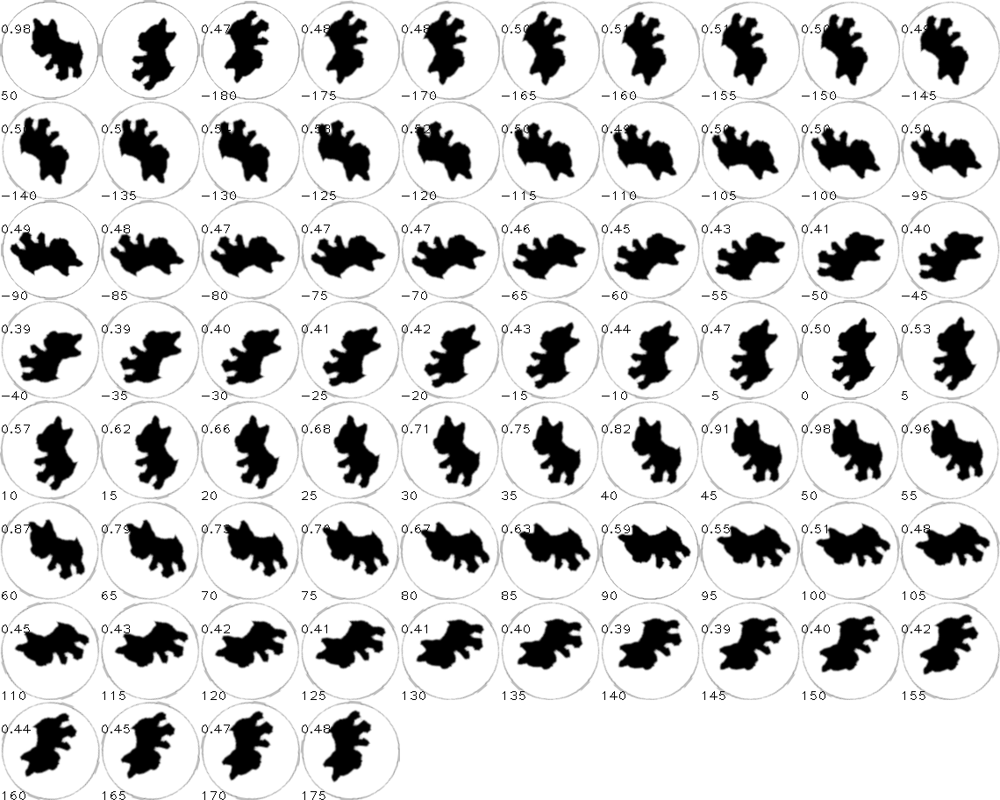

# golang + opencv + gocv 样例项目

- 基础库制作: `docker build -f Dockerfile-base -t ohko/gocv-base-440 .`

- 项目制作: `docker build -f Dockerfile -t ohko/opencv_test .`

- 项目测试: `docker run --rm -it ohko/opencv_test`



``` shell
$ go run .
[   data/1/3.png -    data/1/2.png] Percent:0.981 Rate:  50 √
[   data/1/3.png -    data/1/4.png] Percent:0.981 Rate: -50 √
[   data/1/3.png -    data/1/5.png] Percent:0.965 Rate:-105 √
[   data/1/3.png -    data/1/6.png] Percent:0.962 Rate:-155 √
[   data/1/3.png -    data/1/7.png] Percent:0.970 Rate: 155 √
[   data/1/3.png -    data/1/8.png] Percent:0.969 Rate: 105 √
[   data/1/3.png -    data/2/9.png] Percent:0.795 Rate: -20 x
[   data/1/3.png -   data/2/10.png] Percent:0.783 Rate: -70 x
[   data/1/3.png -   data/2/11.png] Percent:0.783 Rate:-120 x
[   data/1/3.png -   data/2/12.png] Percent:0.793 Rate:-175 x
[   data/1/3.png -   data/2/13.png] Percent:0.802 Rate: 135 x
[   data/1/3.png -   data/2/15.png] Percent:0.802 Rate:  30 x
[   data/1/3.png -   data/3/16.png] Percent:0.794 Rate:-170 x
[   data/1/3.png -   data/3/17.png] Percent:0.793 Rate: 140 x
[   data/1/3.png -   data/3/18.png] Percent:0.783 Rate:  90 x
[   data/1/3.png -   data/3/19.png] Percent:0.782 Rate:  40 x
[   data/1/3.png -   data/3/21.png] Percent:0.788 Rate: -65 x
[   data/1/3.png -   data/3/22.png] Percent:0.795 Rate:-115 x
[   data/1/3.png -    data/4/2.png] Percent:0.665 Rate:-120 x
[   data/1/3.png -    data/4/3.png] Percent:0.668 Rate:-175 x
[   data/1/3.png -    data/4/4.png] Percent:0.673 Rate: 135 x
[   data/1/3.png -    data/4/5.png] Percent:0.671 Rate:  80 x
[   data/1/3.png -    data/4/6.png] Percent:0.669 Rate:  30 x
[   data/1/3.png -    data/4/7.png] Percent:0.664 Rate: -20 x
[   data/1/3.png -    data/5/1.png] Percent:0.602 Rate:   0 x
[   data/1/3.png -    data/5/2.png] Percent:0.606 Rate: -50 x
[   data/1/3.png -    data/5/3.png] Percent:0.610 Rate:-100 x
[   data/1/3.png -    data/5/4.png] Percent:0.612 Rate:-155 x
[   data/1/3.png -    data/5/5.png] Percent:0.618 Rate: 155 x
[   data/1/3.png -    data/5/6.png] Percent:0.611 Rate: 100 x
[   data/1/3.png -   data/12/2.png] Percent:0.641 Rate: 140 x
[   data/1/3.png -   data/12/3.png] Percent:0.644 Rate:  95 x
[   data/1/3.png -   data/12/4.png] Percent:0.658 Rate:  40 x
[   data/1/3.png -   data/12/5.png] Percent:0.663 Rate: -15 x
[   data/1/3.png -   data/12/6.png] Percent:0.670 Rate: -65 x
[   data/1/3.png -   data/12/7.png] Percent:0.657 Rate:-115 x

[  data/2/14.png -    data/1/2.png] Percent:0.794 Rate: -30 x
[  data/2/14.png -    data/1/4.png] Percent:0.806 Rate:-135 x
[  data/2/14.png -    data/1/5.png] Percent:0.807 Rate: 175 x
[  data/2/14.png -    data/1/6.png] Percent:0.799 Rate: 120 x
[  data/2/14.png -    data/1/7.png] Percent:0.796 Rate:  70 x
[  data/2/14.png -    data/1/8.png] Percent:0.799 Rate:  20 x
[  data/2/14.png -    data/2/9.png] Percent:0.973 Rate:-105 √
[  data/2/14.png -   data/2/10.png] Percent:0.965 Rate:-155 √
[  data/2/14.png -   data/2/11.png] Percent:0.964 Rate: 155 √
[  data/2/14.png -   data/2/12.png] Percent:0.970 Rate: 105 √
[  data/2/14.png -   data/2/13.png] Percent:0.981 Rate:  50 √
[  data/2/14.png -   data/2/15.png] Percent:0.976 Rate: -50 √
[  data/2/14.png -   data/3/16.png] Percent:0.757 Rate:  95 x
[  data/2/14.png -   data/3/17.png] Percent:0.756 Rate:  40 x
[  data/2/14.png -   data/3/18.png] Percent:0.762 Rate: -15 x
[  data/2/14.png -   data/3/19.png] Percent:0.767 Rate: -65 x
[  data/2/14.png -   data/3/21.png] Percent:0.771 Rate:-165 x
[  data/2/14.png -   data/3/22.png] Percent:0.760 Rate: 145 x
[  data/2/14.png -    data/4/2.png] Percent:0.670 Rate: 150 x
[  data/2/14.png -    data/4/3.png] Percent:0.681 Rate:  95 x
[  data/2/14.png -    data/4/4.png] Percent:0.686 Rate:  45 x
[  data/2/14.png -    data/4/5.png] Percent:0.684 Rate: -10 x
[  data/2/14.png -    data/4/6.png] Percent:0.675 Rate: -60 x
[  data/2/14.png -    data/4/7.png] Percent:0.661 Rate:-110 x
[  data/2/14.png -    data/5/1.png] Percent:0.615 Rate: -70 x
[  data/2/14.png -    data/5/2.png] Percent:0.628 Rate:-120 x
[  data/2/14.png -    data/5/3.png] Percent:0.636 Rate:-170 x
[  data/2/14.png -    data/5/4.png] Percent:0.640 Rate: 135 x
[  data/2/14.png -    data/5/5.png] Percent:0.657 Rate:  85 x
[  data/2/14.png -    data/5/6.png] Percent:0.639 Rate:  35 x
[  data/2/14.png -   data/12/2.png] Percent:0.578 Rate:  50 x
[  data/2/14.png -   data/12/3.png] Percent:0.582 Rate:  -5 x
[  data/2/14.png -   data/12/4.png] Percent:0.585 Rate: -50 x
[  data/2/14.png -   data/12/5.png] Percent:0.596 Rate:-100 x
[  data/2/14.png -   data/12/6.png] Percent:0.599 Rate:-155 x
[  data/2/14.png -   data/12/7.png] Percent:0.592 Rate: 155 x

[  data/3/20.png -    data/1/2.png] Percent:0.776 Rate:  65 x
[  data/3/20.png -    data/1/4.png] Percent:0.772 Rate: -40 x
[  data/3/20.png -    data/1/5.png] Percent:0.762 Rate: -95 x
[  data/3/20.png -    data/1/6.png] Percent:0.747 Rate:-145 x
[  data/3/20.png -    data/1/7.png] Percent:0.755 Rate: 165 x
[  data/3/20.png -    data/1/8.png] Percent:0.759 Rate: 115 x
[  data/3/20.png -    data/2/9.png] Percent:0.760 Rate:  15 x
[  data/3/20.png -   data/2/10.png] Percent:0.752 Rate: -35 x
[  data/3/20.png -   data/2/11.png] Percent:0.755 Rate: -85 x
[  data/3/20.png -   data/2/12.png] Percent:0.758 Rate:-140 x
[  data/3/20.png -   data/2/13.png] Percent:0.763 Rate: 165 x
[  data/3/20.png -   data/2/15.png] Percent:0.762 Rate:  65 x
[  data/3/20.png -   data/3/16.png] Percent:0.960 Rate:-155 √
[  data/3/20.png -   data/3/17.png] Percent:0.953 Rate: 155 √
[  data/3/20.png -   data/3/18.png] Percent:0.960 Rate: 105 √
[  data/3/20.png -   data/3/19.png] Percent:0.978 Rate:  50 √
[  data/3/20.png -   data/3/21.png] Percent:0.976 Rate: -50 √
[  data/3/20.png -   data/3/22.png] Percent:0.971 Rate:-105 √
[  data/3/20.png -    data/4/2.png] Percent:0.654 Rate: -85 x
[  data/3/20.png -    data/4/3.png] Percent:0.656 Rate:-135 x
[  data/3/20.png -    data/4/4.png] Percent:0.660 Rate: 170 x
[  data/3/20.png -    data/4/5.png] Percent:0.649 Rate: 120 x
[  data/3/20.png -    data/4/6.png] Percent:0.644 Rate:  65 x
[  data/3/20.png -    data/4/7.png] Percent:0.640 Rate:  15 x
[  data/3/20.png -    data/5/1.png] Percent:0.616 Rate:  50 x
[  data/3/20.png -    data/5/2.png] Percent:0.632 Rate:  -5 x
[  data/3/20.png -    data/5/3.png] Percent:0.633 Rate: -55 x
[  data/3/20.png -    data/5/4.png] Percent:0.633 Rate:-105 x
[  data/3/20.png -    data/5/5.png] Percent:0.636 Rate:-155 x
[  data/3/20.png -    data/5/6.png] Percent:0.619 Rate: 155 x
[  data/3/20.png -   data/12/2.png] Percent:0.611 Rate: 165 x
[  data/3/20.png -   data/12/3.png] Percent:0.614 Rate: 110 x
[  data/3/20.png -   data/12/4.png] Percent:0.631 Rate:  60 x
[  data/3/20.png -   data/12/5.png] Percent:0.640 Rate:   5 x
[  data/3/20.png -   data/12/6.png] Percent:0.641 Rate: -45 x
[  data/3/20.png -   data/12/7.png] Percent:0.633 Rate: -95 x

[   data/4/1.png -    data/1/2.png] Percent:0.647 Rate: 120 x
[   data/4/1.png -    data/1/4.png] Percent:0.663 Rate:  20 x
[   data/4/1.png -    data/1/5.png] Percent:0.655 Rate: -30 x
[   data/4/1.png -    data/1/6.png] Percent:0.645 Rate: -80 x
[   data/4/1.png -    data/1/7.png] Percent:0.637 Rate:-135 x
[   data/4/1.png -    data/1/8.png] Percent:0.635 Rate: 170 x
[   data/4/1.png -    data/2/9.png] Percent:0.683 Rate:  60 x
[   data/4/1.png -   data/2/10.png] Percent:0.683 Rate:  10 x
[   data/4/1.png -   data/2/11.png] Percent:0.677 Rate: -40 x
[   data/4/1.png -   data/2/12.png] Percent:0.665 Rate: -95 x
[   data/4/1.png -   data/2/13.png] Percent:0.655 Rate:-145 x
[   data/4/1.png -   data/2/15.png] Percent:0.668 Rate: 110 x
[   data/4/1.png -   data/3/16.png] Percent:0.613 Rate:-120 x
[   data/4/1.png -   data/3/17.png] Percent:0.606 Rate:-170 x
[   data/4/1.png -   data/3/18.png] Percent:0.616 Rate: 135 x
[   data/4/1.png -   data/3/19.png] Percent:0.637 Rate:  85 x
[   data/4/1.png -   data/3/21.png] Percent:0.642 Rate: -15 x
[   data/4/1.png -   data/3/22.png] Percent:0.621 Rate: -65 x
[   data/4/1.png -    data/4/2.png] Percent:0.973 Rate: -50 √
[   data/4/1.png -    data/4/3.png] Percent:0.972 Rate:-105 √
[   data/4/1.png -    data/4/4.png] Percent:0.959 Rate:-155 √
[   data/4/1.png -    data/4/5.png] Percent:0.946 Rate: 155 √
[   data/4/1.png -    data/4/6.png] Percent:0.956 Rate: 100 √
[   data/4/1.png -    data/4/7.png] Percent:0.978 Rate:  50 √
[   data/4/1.png -    data/5/1.png] Percent:0.624 Rate:  75 x
[   data/4/1.png -    data/5/2.png] Percent:0.644 Rate:  25 x
[   data/4/1.png -    data/5/3.png] Percent:0.648 Rate: -20 x
[   data/4/1.png -    data/5/4.png] Percent:0.643 Rate: -80 x
[   data/4/1.png -    data/5/5.png] Percent:0.620 Rate:-130 x
[   data/4/1.png -    data/5/6.png] Percent:0.616 Rate: 175 x
[   data/4/1.png -   data/12/2.png] Percent:0.519 Rate:-155 x
[   data/4/1.png -   data/12/3.png] Percent:0.523 Rate: 155 x
[   data/4/1.png -   data/12/4.png] Percent:0.537 Rate: 100 x
[   data/4/1.png -   data/12/5.png] Percent:0.551 Rate:  50 x
[   data/4/1.png -   data/12/6.png] Percent:0.566 Rate:   0 x
[   data/4/1.png -   data/12/7.png] Percent:0.545 Rate: -50 x

[   data/5/7.png -    data/1/2.png] Percent:0.616 Rate:   0 x
[   data/5/7.png -    data/1/4.png] Percent:0.610 Rate:-100 x
[   data/5/7.png -    data/1/5.png] Percent:0.595 Rate:-150 x
[   data/5/7.png -    data/1/6.png] Percent:0.591 Rate: 160 x
[   data/5/7.png -    data/1/7.png] Percent:0.597 Rate: 105 x
[   data/5/7.png -    data/1/8.png] Percent:0.599 Rate:  55 x
[   data/5/7.png -    data/2/9.png] Percent:0.630 Rate: -85 x
[   data/5/7.png -   data/2/10.png] Percent:0.609 Rate:-135 x
[   data/5/7.png -   data/2/11.png] Percent:0.597 Rate: 170 x
[   data/5/7.png -   data/2/12.png] Percent:0.604 Rate: 120 x
[   data/5/7.png -   data/2/13.png] Percent:0.614 Rate:  70 x
[   data/5/7.png -   data/2/15.png] Percent:0.638 Rate: -35 x
[   data/5/7.png -   data/3/16.png] Percent:0.616 Rate: 105 x
[   data/5/7.png -   data/3/17.png] Percent:0.623 Rate:  55 x
[   data/5/7.png -   data/3/18.png] Percent:0.639 Rate:   0 x
[   data/5/7.png -   data/3/19.png] Percent:0.635 Rate: -50 x
[   data/5/7.png -   data/3/21.png] Percent:0.614 Rate:-150 x
[   data/5/7.png -   data/3/22.png] Percent:0.607 Rate: 155 x
[   data/5/7.png -    data/4/2.png] Percent:0.621 Rate:-175 x
[   data/5/7.png -    data/4/3.png] Percent:0.619 Rate: 130 x
[   data/5/7.png -    data/4/4.png] Percent:0.640 Rate:  75 x
[   data/5/7.png -    data/4/5.png] Percent:0.650 Rate:  25 x
[   data/5/7.png -    data/4/6.png] Percent:0.640 Rate: -25 x
[   data/5/7.png -    data/4/7.png] Percent:0.630 Rate: -75 x
[   data/5/7.png -    data/5/1.png] Percent:0.951 Rate: -50 √
[   data/5/7.png -    data/5/2.png] Percent:0.941 Rate:-105 √
[   data/5/7.png -    data/5/3.png] Percent:0.929 Rate:-155 √
[   data/5/7.png -    data/5/4.png] Percent:0.942 Rate: 155 √
[   data/5/7.png -    data/5/5.png] Percent:0.954 Rate: 105 √
[   data/5/7.png -    data/5/6.png] Percent:0.967 Rate:  50 √
[   data/5/7.png -   data/12/2.png] Percent:0.591 Rate: 105 x
[   data/5/7.png -   data/12/3.png] Percent:0.605 Rate:  55 x
[   data/5/7.png -   data/12/4.png] Percent:0.606 Rate:   0 x
[   data/5/7.png -   data/12/5.png] Percent:0.597 Rate: -50 x
[   data/5/7.png -   data/12/6.png] Percent:0.572 Rate:  25 x
[   data/5/7.png -   data/12/7.png] Percent:0.575 Rate: -25 x

[  data/12/1.png -    data/1/2.png] Percent:0.651 Rate:-140 x
[  data/12/1.png -    data/1/4.png] Percent:0.642 Rate: 115 x
[  data/12/1.png -    data/1/5.png] Percent:0.646 Rate:  65 x
[  data/12/1.png -    data/1/6.png] Percent:0.658 Rate:  10 x
[  data/12/1.png -    data/1/7.png] Percent:0.659 Rate: -35 x
[  data/12/1.png -    data/1/8.png] Percent:0.657 Rate: -90 x
[  data/12/1.png -    data/2/9.png] Percent:0.561 Rate: 160 x
[  data/12/1.png -   data/2/10.png] Percent:0.551 Rate: 105 x
[  data/12/1.png -   data/2/11.png] Percent:0.560 Rate:  55 x
[  data/12/1.png -   data/2/12.png] Percent:0.577 Rate:   0 x
[  data/12/1.png -   data/2/13.png] Percent:0.583 Rate: -55 x
[  data/12/1.png -   data/2/15.png] Percent:0.571 Rate:-155 x
[  data/12/1.png -   data/3/16.png] Percent:0.641 Rate:  -5 x
[  data/12/1.png -   data/3/17.png] Percent:0.635 Rate: -60 x
[  data/12/1.png -   data/3/18.png] Percent:0.629 Rate:-110 x
[  data/12/1.png -   data/3/19.png] Percent:0.617 Rate:-160 x
[  data/12/1.png -   data/3/21.png] Percent:0.614 Rate:  95 x
[  data/12/1.png -   data/3/22.png] Percent:0.626 Rate:  45 x
[  data/12/1.png -    data/4/2.png] Percent:0.545 Rate:  50 x
[  data/12/1.png -    data/4/3.png] Percent:0.562 Rate:   0 x
[  data/12/1.png -    data/4/4.png] Percent:0.568 Rate: -50 x
[  data/12/1.png -    data/4/5.png] Percent:0.562 Rate:-100 x
[  data/12/1.png -    data/4/6.png] Percent:0.549 Rate:-155 x
[  data/12/1.png -    data/4/7.png] Percent:0.536 Rate: 155 x
[  data/12/1.png -    data/5/1.png] Percent:0.585 Rate: 150 x
[  data/12/1.png -    data/5/2.png] Percent:0.599 Rate: 100 x
[  data/12/1.png -    data/5/3.png] Percent:0.605 Rate:  50 x
[  data/12/1.png -    data/5/4.png] Percent:0.605 Rate:   0 x
[  data/12/1.png -    data/5/5.png] Percent:0.594 Rate: -50 x
[  data/12/1.png -    data/5/6.png] Percent:0.578 Rate:-105 x
[  data/12/1.png -   data/12/2.png] Percent:0.966 Rate: -50 √
[  data/12/1.png -   data/12/3.png] Percent:0.936 Rate:-105 √
[  data/12/1.png -   data/12/4.png] Percent:0.940 Rate:-155 √
[  data/12/1.png -   data/12/5.png] Percent:0.946 Rate: 155 √
[  data/12/1.png -   data/12/6.png] Percent:0.942 Rate: 100 √
[  data/12/1.png -   data/12/7.png] Percent:0.963 Rate:  50 √
```