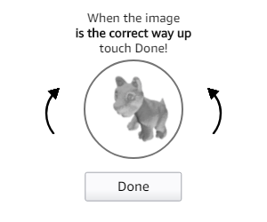
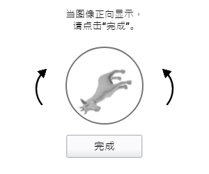

# Golang+OpenCV 搞定旋转验证码

## 前言
在一个自动化项目中，有一个图片+旋转的验证码环节，系统会随机输出一张图片，并且是在服务端旋转后的图片，让用户根据视觉感官来判断旋转角度，然后需要用丝滑的手指在左旋转或右旋转按钮上点击鼠标左键，每次点击就会旋转一定的角度。当大脑收到视觉信号，感觉图像应该正了，就可以点击提交按钮，页面脚本会将旋转的角度发送到服务端进行验证。正了就通过，不正就会重新输出一张图片再来一次上面的过程。

## 实例图片



## 问题梳理
- 如何计算应该旋转多少角度？
- 应该向哪个方向转动？

## 思路整理
- 准备一个大的图库，将图片进行一一对比，如果图库中有，就直接输出角度和方向，如果没有，就记录在库中，等待人工处理后标记角度和方向，方便下次使用。
- 由于这是一个验证码识别过程，不存在高性能高并发的问题，所以用一个大库来做完全是可以的。但是，难道1张图片要记录360张不同角度的图片数据？显然不切实际，不科学，就是一小学生作业了。
- 我们将方案修改一下，图库还是得要的，用来做对比用，只保留一张正面图片就可以了。我们拿到一张需要识别的图是，和图库中的图片一一对比打分，最后获得最高分的大概率就是一样的图了。
- 我们将图片每5度的角度旋转再和最高分的基准图进行对比，同样的道理，得分最高也就是需要旋转的角度了。
- 遇到新的图，我们先讲图存在图库中，等待人工调正角度后入库。
- 当然，此方案并不能保证100%正确，90%以上的正确率那是没问题的。
- 接下来我们说说代码的核心部分，配合视频查看味道更佳：https://www.bilibili.com/video/BV1yr4y1i7kf/
- 可参考完整源代码：https://github.com/ohko/go-opencv-test

## 核心代码讲解

### Check(): 360旋转对比图像，返回最优对比结果
此方法返回值中有每个角度可视化图片，方便查看每个角度的相似度

```golang
// 最优角度和百分比
okRate := float64(0)
okPercent := float64(0)

// 360度旋转，旋转角度由参数angle控制
for r := -180.0; r < 180; r += angle {
    func() {
        // 旋转图片
        ro := o.RotationImg(chk, r)
        defer ro.Close()

        // 获取图像相似度
        minConfidence, ro := o.Check1(tpl, ro)
        if minConfidence > okPercent {
            okPercent = minConfidence
            okRate = r
        }
    }()
}
```

### Check1(): 返回图像相似度，不同角度相似度不同
此方法返回值中有相似点的链接图，方便查看链接的相似点是否正确

```golang
mask := gocv.NewMat()
// 查找相似度矩阵
gocv.MatchTemplate(chk, tpl, &matResult, gocv.TmCcoeffNormed, mask)
mask.Close()
// 在矩阵中查找相似度最小值
minConfidence, _, _, _ := gocv.MinMaxLoc(matResult)
return float64(minConfidence), chk
```

### Check2(): 返回图像相似度，与角度无关
```golang
// 特征提取
kp1, des1 := orb.DetectAndCompute(tpl, a)
kp2, des2 := orb.DetectAndCompute(chk, b)

// 特征匹配，计算匹配的点
bf := gocv.NewBFMatcherWithParams(gocv.NormHamming, false)
matches := bf.KnnMatch(des1, des2, 2)
var good1, good2 []gocv.KeyPoint
for _, v := range matches {
    if v[0].Distance < 0.5*v[1].Distance {
        good1 = append(good1, kp1[v[0].QueryIdx])
        good2 = append(good2, kp2[v[0].TrainIdx])
    }
}
```
### AnalyseAnimal(): 分析主体图像
```golang
// 找出关键的主体图像部分
animal := o.FindAnimal(img)

// 将尺寸统一化
compress := gocv.NewMatWithSize(o.Width, o.Height, gocv.MatTypeCV8U)
gocv.Resize(animal, &compress, image.Pt(compress.Rows(), compress.Cols()), 0, 0, gocv.InterpolationCubic)

// 可选操作，先高斯模糊在腐蚀一下图片，去除个别小的噪点
if optimize {
    gocv.GaussianBlur(compress, &compress, image.Pt(3, 3), 0, 0, gocv.BorderWrap)
    x := gocv.NewMat()
    defer x.Close()
    gocv.Dilate(compress, &compress, x)
}
```

## 测试
代码查看`main.go`
- check1()：用正确角度的基准图与测试图进行一一对比，展示相似度和相应的角度。
- check2()：用正确角度的基准图与测试图进行匹配打分，高于0.1可当作是同一张图片的不同角度。
- check3()：和check2类似，只是检测的是一张图片。

## 总结
本方案不是最优的解决方案，我想正在看文章的你肯定还有更好的解决方案，请多多吐槽、讨论！
主要还是仰仗opencv库，Golang只是实现了逻辑，换成Python、PHP、Java、C++等语言都可以实现。